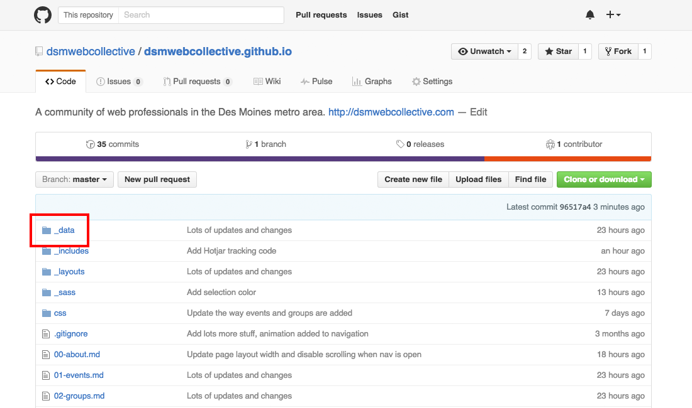
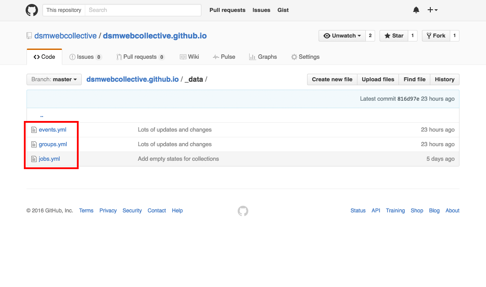
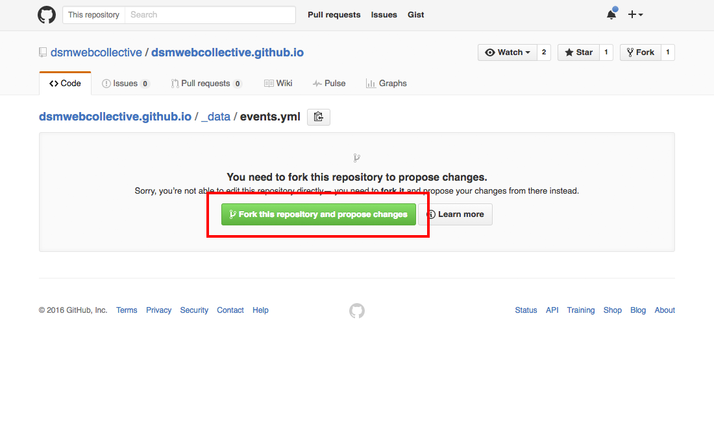
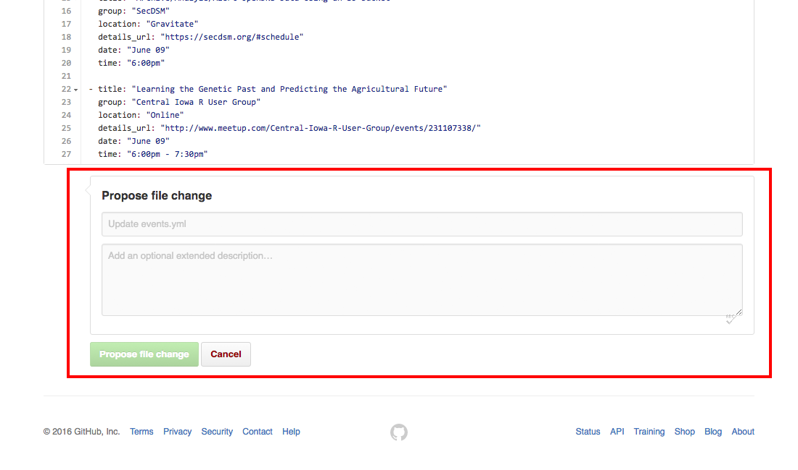

# Contributing

This is where you can learn how to contribute to the Des Moines Web Collective community!

__Notes__

- Follow the individual instructions for each type.
- Be sure to match the format of the other data.

## Table of Contents

- [Adding an event, user group, or job](#adding-an-event-user-group-or-job)
- [Event Guidlines](#event-guidelines)
- [User Group Guidlines](#user-group-guidelines)
- [Job Guidlines](#job-guidelines)
- [Additional Help](#additional-help)

## Adding an event, user group, or job

1. Navigate to the [_data](./_data) folder. 
1. Click the file you would like to edit. 
1. Click the edit icon. 
1. Fork the repository if prompted to.  
1. Add your content to the file. Each file will have an example at the top. You can just copy that and update it with your information. 
1. Say what changes you made and click "Propose file change". 

## Event Guidelines

- Events should be organized by date and then time.

## User Group Guidelines

- User groups should be organized alphabetically.

## Job Guidelines

- Jobs should be organized alphabetically by company and then job title.

## Additional Help

If you would prefer to just send the information and have us add it for you, [just contact us](http://dsmwebcollective.com/contact/).
